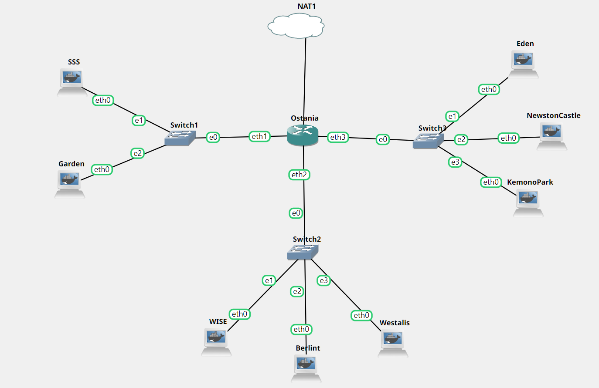
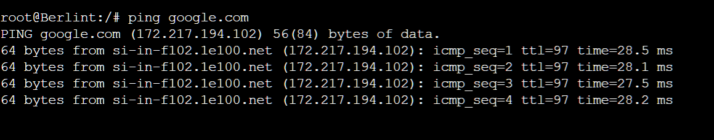
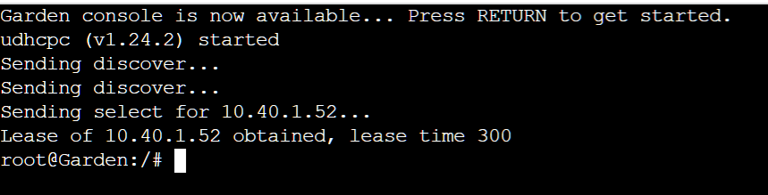
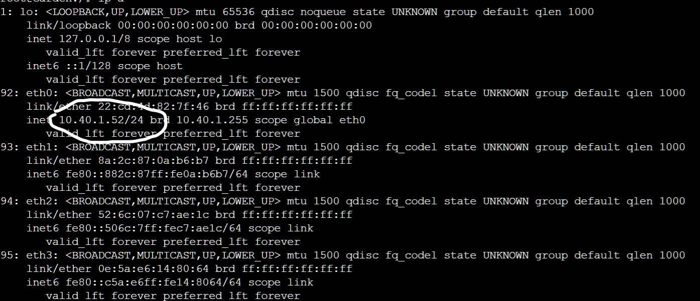
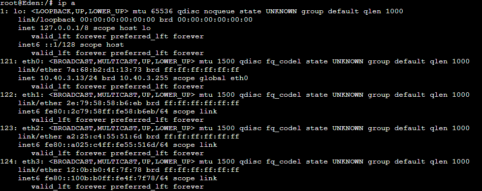

# soal-shift-jarkom-3-ITA01-2022

Repository Laporan Resmi Praktikum Jaringan Komputer Modul 3 Kelompok ITA01 Tahun 2022.

1. Damarhafni Rahmannabel Nadim P (5027201026)
2. Salman Al Farisi Sudirlan (5027201056)
3. I Putu Windy Arya Sagita (5027201071)

# Daftar Isi

* [Daftar Isi](https://github.com/windyarya/Jarkom-Modul-3-ITA01-2022#daftar-isi)
* [Soal 1](https://github.com/windyarya/Jarkom-Modul-3-ITA01-2022/#soal-1)
* [Soal 2](https://github.com/windyarya/Jarkom-Modul-3-ITA01-2022/#soal-2)
* [Soal 3](https://github.com/windyarya/Jarkom-Modul-3-ITA01-2022/soal-3)
* [Soal 4](https://github.com/windyarya/Jarkom-Modul-3-ITA01-2022/#soal-4)
* [Soal 5](https://github.com/windyarya/Jarkom-Modul-3-ITA01-2022/#soal-5)
* [Soal 6](https://github.com/windyarya/Jarkom-Modul-3-ITA01-2022/#soal-6)
* [Soal 7](https://github.com/windyarya/Jarkom-Modul-3-ITA01-2022/#soal-7)
* [Soal 8](https://github.com/windyarya/Jarkom-Modul-3-ITA01-2022/#soal-8)

# Soal 1
Loid bersama Franky berencana membuat peta tersebut dengan kriteria WISE sebagai DNS Server, Westalis sebagai DHCP Server, Berlint sebagai Proxy Server

## Pengerjaan Soal
### Topologi
Berikut adalah topologi jaringan untuk soal shift 2 yang kami buat:<br>
<br>

### Konfigurasi IP Address
Berikut adalah konfigurasi IP untuk setiap node yang ada pada topologi kami.
#### Ostania
```
 auto eth0
 iface eth0 inet dhcp

auto eth1
iface eth1 inet static
	address 10.40.1.1
	netmask 255.255.255.0

auto eth2
iface eth2 inet static
	address 10.40.2.1
	netmask 255.255.255.0

auto eth3
iface eth3 inet static
	address 10.40.3.1
	netmask 255.255.255.0
```

#### Wise
```
auto eth0
iface eth0 inet static
	address 10.40.2.2
	netmask 255.255.255.0
	gateway 10.40.2.1
```

#### Berlint
```
auto eth0
iface eth0 inet static
	address 10.40.2.3
	netmask 255.255.255.0
	gateway 10.40.2.1
```

#### Westalis
```
auto eth0
iface eth0 inet static
	address 10.40.2.4
	netmask 255.255.255.0
	gateway 10.40.2.1
```

#### Eden
```
auto eth0
iface eth0 inet dhcp
hwaddress ether 7a:68:b2:d1:13:73
```

#### NewstonCastle
```
auto eth0
iface eth0 inet dhcp
```

#### KemonoPark
```
auto eth0
iface eth0 inet dhcp
```

#### SSS
```
auto eth0
iface eth0 inet dhcp
```

#### Garden
```
auto eth0
iface eth0 inet dhcp
```

#### Persiapan Berlint
```
apt-get update
apt-get install libapache2-mod-php7.0 -y
apt-get install squid -y
```

#### Persiapan Westalis
``` 
apt-get update
apt-get install isc-dhcp-server -y
```

#### Persiapan Wise
```
apt-get update
apt-get install bind9 -y
```

## Kendala
Tidak ada kendala

## Dokumentasi Soal 2
- Mencoba ping `google.com` pada salah satu komputer server<br>
<br>

# Soal 2
dan Ostania sebagai DHCP Relay

## Pengerjaan Soal
Pada lokasi /etc/default/isc-dhcp-relay di ostania Kami menambah perintah perintah
```
# What servers should the DHCP relay forward requests to?
SERVERS=\"10.40.2.4\"
# On what interfaces should the DHCP relay (dhrelay) serve DHCP requests?
INTERFACES=\"eth1 eth2 eth3\"
# Additional options that are passed to the DHCP relay daemon?
OPTIONS=\"\"
```

Lalu lakukan perintah untuk menjalankan perintahnya
```
service isc-dhcp-relay star
```

## Dokumentasi Soal 2
- Maka Eden akan mendapatkan IP ```10.40.3.13```<br>
<br>

## Kendala
Tidak ada kendala

# Soal 3
Loid dan Franky menyusun peta tersebut dengan hati-hati dan teliti.

Ada beberapa kriteria yang ingin dibuat oleh Loid dan Franky, yaitu:
1. Semua client yang ada HARUS menggunakan konfigurasi IP dari DHCP Server.
2. Client yang melalui Switch1 mendapatkan range IP dari [prefix IP].1.50 - [prefix IP].1.88 dan [prefix IP].1.120 - [prefix IP].1.155

## Pengerjaan Soal
Edit file /etc/dhcp/dhcpd.conf dengan isi
```
subnet 10.40.1.0 netmask 255.255.255.0 {
        range 10.40.1.50 10.40.1.88;
        range 10.40.1.120 10.40.1.155;
        option routers 10.40.1.1;
        option broadcast-address 10.40.1.255;
        option domain-name-servers 10.40.2.2;
}

subnet 10.40.2.0 netmask 255.255.255.0 {}
```

Jangan lupa restart dhcpnya sebelum menjalankannya
```
service isc-dhcp-server restart
```

## Kendala
Tidak ada kendala

## Dokumentasi Soal 3
- <br>
<br>

# Soal 7
Loid dan Franky berencana menjadikan Eden sebagai server untuk pertukaran informasi dengan alamat IP yang tetap dengan IP [prefix IP].3.13 dengan Prefix IP 10.40

## Pengerjaan Soal
Menambahkan konfigurasi untuk fixed address pada ```/etc/dhcp/dhcpd.conf```
```sh 
host Eden {
        hardware ethernet 7a:68:b2:d1:13:73;
        fixed-address 10.40.3.13;
}

service isc-dhcp-server restart
```

## kendala 
Tidak ada

## Dokumentasi Soal 7
- Maka Eden akan mendapatkan IP ```10.40.3.13```<br>
<br>

# Soal 8
SSS, Garden, dan Eden digunakan sebagai client Proxy agar pertukaran informasi dapat terjamin keamanannya, juga untuk mencegah kebocoran data.

Pada Proxy Server di Berlint, Loid berencana untuk mengatur bagaimana Client dapat mengakses internet. Artinya setiap client harus menggunakan Berlint sebagai HTTP & HTTPS proxy. Adapun kriteria pengaturannya adalah sebagai berikut:

*1. Client hanya dapat mengakses internet diluar (selain) hari & jam kerja (senin-jumat 08.00 - 17.00) dan hari libur (dapat mengakses 24 jam penuh)
*2. Adapun pada hari dan jam kerja sesuai nomor (1), client hanya dapat mengakses domain loid-work.com dan franky-work.com (IP tujuan domain dibebaskan)
*3. Saat akses internet dibuka, client dilarang untuk mengakses web tanpa HTTPS. (Contoh web HTTP: http://example.com)
*4. Agar menghemat penggunaan, akses internet dibatasi dengan kecepatan maksimum 128 Kbps pada setiap host (Kbps = kilobit per second; lakukan pengecekan pada tiap host, ketika 2 host akses internet pada saat bersamaan, keduanya mendapatkan speed maksimal yaitu 128 Kbps)
*5. Setelah diterapkan, ternyata peraturan nomor (4) mengganggu produktifitas saat hari kerja, dengan demikian pembatasan kecepatan hanya diberlakukan untuk pengaksesan internet pada hari libur

Setelah proxy Berlint diatur oleh Loid, dia melakukan pengujian dan mendapatkan hasil sesuai tabel berikut.

| Aksi | Senin (10.00) | Senin (20.00) | Sabtu (10.00)|
| ------------- |-------------| -----| -----|
|Akses Internet (HTTP) | X | X | X|
|Akses Internet (HTTPS) | X | V | V|
|Akses loid-work.com dan franky-work.com | V | X | X|
|Speed limit (128Kbps) | tidak bisa akses | X (Speed tidak dibatasi) | V|

X: Tidak
V: Iya

## Pengerjaan Soal
### Client Berlint
- Memindahkan file pada ```/etc/squid/squid.conf``` ke ```/etc/squid/squid.conf.bak``` dengan command:

```sh
mv /etc/squid/squid.conf /etc/squid/squid.conf.bak
```

- Memasukkan konfigurasi berikut ke dalam ```/etc/squid/work-sites.acl```
```sh
loid-work.com
franky-work.com
```

- Menambahkan konfigurasi berikut ke dalam ```/etc/squid/acl.conf``` agar internet dapat diakses pada jam tertentu. M=Senin, T=Selasa, W=Rabu, H=Kamis, F=Jumat, S=Minggu, dan A=Sabtu.
```sh
acl AVAILABLE_INTERNET time MTWHF 17:00-23:59
acl AVAILABLE_INTERNET time MTWHF 00:00-08:00
acl AVAILABLE_INTERNET time SA 00:00-23:59
```

- Menambahkan konfigurasi berikut ke dalam ```/etc/squid/squid.conf``` agar internet dapat memblokir situs tertentu dan internet pada saat jam kerja.
```sh
include /etc/squid/acl.conf
http_port 8080
visible_hostname Berlint

acl SSL_ports port 443
acl WORKSITES dstdomain "/etc/squid/work-sites.acl"

#http_access deny !SSL_ports
#http_access allow all
#http_access deny WORKSITES
#http_access allow all
http_access allow AVAILABLE_INTERNET
http_access deny all
#http_access allow WORKSITES
http_access deny WORKSITES

delay_pools 1
delay_class 1 2
delay_access 1 allow all
delay_parameters 1 none 16000/16000
```

## Kendala
Tidak ada.

## Dokumentasi Soal 8
- ```lynx google.com```<br>
<br>
- ```lynx loid-work.com``<br>

