# soal-shift-jarkom-3-ITA01-2022

Repository Laporan Resmi Praktikum Jaringan Komputer Modul 3 Kelompok ITA01 Tahun 2022.

1. Damarhafni Rahmannabel Nadim P (5027201026)
2. Salman Al Farisi Sudirlan (5027201056)
3. I Putu Windy Arya Sagita (5027201071)

# Daftar Isi

* [Daftar Isi](https://github.com/windyarya/Jarkom-Modul-3-ITA01-2022#daftar-isi)
* [Soal 1](https://github.com/windyarya/Jarkom-Modul-3-ITA01-2022/#soal-1)
* [Soal 2](https://github.com/windyarya/Jarkom-Modul-3-ITA01-2022/#soal-2)
* [Soal 3](https://github.com/windyarya/Jarkom-Modul-3-ITA01-2022/soal-3)
* [Soal 4](https://github.com/windyarya/Jarkom-Modul-3-ITA01-2022/#soal-4)
* [Soal 5](https://github.com/windyarya/Jarkom-Modul-3-ITA01-2022/#soal-5)
* [Soal 6](https://github.com/windyarya/Jarkom-Modul-3-ITA01-2022/#soal-6)
* [Soal 7](https://github.com/windyarya/Jarkom-Modul-3-ITA01-2022/#soal-7)
* [Soal 8](https://github.com/windyarya/Jarkom-Modul-3-ITA01-2022/#soal-8)

# Soal 1

Loid bersama Franky berencana membuat peta tersebut dengan kriteria WISE sebagai DNS Server, Westalis sebagai DHCP Server, Berlint sebagai Proxy Server

## Pengerjaan Soal

### Topologi

Berikut adalah topologi jaringan untuk soal shift 2 yang kami buat:


### Konfigurasi IP Address

Berikut adalah konfigurasi IP untuk setiap node yang ada pada topologi kami.

#### Ostania

```bash
auto eth0
iface eth0 inet dhcp

auto eth1
iface eth1 inet static
 address 10.40.1.1
 netmask 255.255.255.0

auto eth2
iface eth2 inet static
 address 10.40.2.1
 netmask 255.255.255.0

auto eth3
iface eth3 inet static
 address 10.40.3.1
 netmask 255.255.255.0
```

#### Wise

```bash
auto eth0
iface eth0 inet static
 address 10.40.2.2
 netmask 255.255.255.0
 gateway 10.40.2.1
```

#### Berlint

```bash
auto eth0
iface eth0 inet static
 address 10.40.2.3
 netmask 255.255.255.0
 gateway 10.40.2.1
```

#### Westalis

```bash
auto eth0
iface eth0 inet static
 address 10.40.2.4
 netmask 255.255.255.0
 gateway 10.40.2.1
```

#### Eden

```bash
auto eth0
iface eth0 inet dhcp
hwaddress ether 7a:68:b2:d1:13:73
```

#### NewstonCastle

```bash
auto eth0
iface eth0 inet dhcp
```

#### KemonoPark

```bash
auto eth0
iface eth0 inet dhcp
```

#### SSS

```bash
auto eth0
iface eth0 inet dhcp
```

#### Garden

```bash
auto eth0
iface eth0 inet dhcp
```

#### Persiapan Berlint

```bash
apt-get update
apt-get install libapache2-mod-php7.0 -y
apt-get install squid -y
```

#### Persiapan Westalis

```bash
apt-get update
apt-get install isc-dhcp-server -y
```

#### Persiapan Wise

```bash
apt-get update
apt-get install bind9 -y
```

## Kendala

Tidak ada kendala

## Dokumentasi Soal 1

* Mencoba `ping google.com` pada salah satu komputer server


# Soal 2

dan Ostania sebagai DHCP Relay

## Pengerjaan Soal

Pada lokasi `/etc/default/isc-dhcp-relay` di ostania Kami menambah perintah perintah

```bash
# What servers should the DHCP relay forward requests to?
SERVERS=\"10.40.2.4\"
# On what interfaces should the DHCP relay (dhrelay) serve DHCP requests?
INTERFACES=\"eth1 eth2 eth3\"
# Additional options that are passed to the DHCP relay daemon?
OPTIONS=\"\"
```

Lalu lakukan perintah untuk menjalankan perintahnya

```bash
service isc-dhcp-relay star
```

## Dokumentasi Soal 2

* Maka Eden akan mendapatkan IP `10.40.3.13`


## Kendala

Tidak ada kendala

# Soal 3

Loid dan Franky menyusun peta tersebut dengan hati-hati dan teliti.

Ada beberapa kriteria yang ingin dibuat oleh Loid dan Franky, yaitu:

1. Semua client yang ada HARUS menggunakan konfigurasi IP dari DHCP Server.
2. Client yang melalui Switch1 mendapatkan range IP dari [prefix IP].1.50 - [prefix IP].1.88 dan [prefix IP].1.120 - [prefix IP].1.155

## Pengerjaan Soal

Edit file `/etc/dhcp/dhcpd.conf` dengan isi

```bash
subnet 10.40.1.0 netmask 255.255.255.0 {
        range 10.40.1.50 10.40.1.88;
        range 10.40.1.120 10.40.1.155;
        option routers 10.40.1.1;
        option broadcast-address 10.40.1.255;
        option domain-name-servers 10.40.2.2;
}

subnet 10.40.2.0 netmask 255.255.255.0 {}
```

Jangan lupa restart dhcpnya sebelum menjalankannya

```bash
service isc-dhcp-server restart
```

## Kendala

Tidak ada kendala

## Dokumentasi Soal 3

* Mengecek ip dengan syntax `ip a`


# Soal 4

Client yang melalui Switch3 mendapatkan range IP dari [prefix IP].3.10 - [prefix IP].3.30 dan [prefix IP].3.60 - [prefix IP].3.85

## Pengerjaan Soal

Edit file `/etc/dhcp/dhcpd.conf` dan tambahkan konfigurasi untuk subnet switch 3 sehingga keseluruhan konfigurasinya akan menjadi sebagai berikut.

```
subnet 10.40.1.0 netmask 255.255.255.0 {
        range 10.40.1.50 10.40.1.88;
        range 10.40.1.120 10.40.1.155;
        option routers 10.40.1.1;
        option broadcast-address 10.40.1.255;
        option domain-name-servers 10.40.2.2;
}

subnet 10.40.2.0 netmask 255.255.255.0 {}

subnet 10.40.3.0 netmask 255.255.255.0 {
        range 10.40.3.10 10.40.3.30;
        range 10.40.3.60 10.40.3.85;
        option routers 10.40.3.1;
        option broadcast-address 10.40.3.255;
        option domain-name-servers 10.40.2.2;
}
```

Jangan lupa restart dhcpnya sebelum menjalankannya

```
service isc-dhcp-server restart
```

## Kendala

Tidak ada kendala

## Dokumentasi Soal 4

* Mengecek ip dengan syntax `ip -br a`

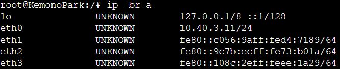

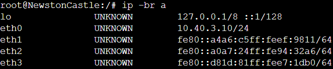

# Soal 5

Client mendapatkan DNS dari WISE dan client dapat terhubung dengan internet melalui DNS tersebut.

## Pengerjaan Soal

Pertama, konfigurasikan WISE pada file `/etc/bind/named.conf.options`. Berikut adalah script konfigurasinya.

```bash
options {
        directory \"/var/cache/bind\";

        forwarders {
                192.168.122.1;
        };

        allow-query { any; };
        auth-nxdomain no;
        listen-on-v6 { any; };
};
```

Untuk membuat client bisa terhubung, pada soal no 3 dan 4 kami sudah menambahkan syntax `option domain-name-servers 10.40.2.2;` pada setiap subnet nya.

Setelah itu jangan lupa untuk merestart bind9 nya.

```
service bind9 restart
```

## Kendala

Tidak ada kendala

## Dokumentasi Soal 5

* Mengecek koneksi internet dengan `ping google.com`

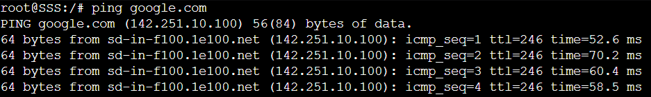

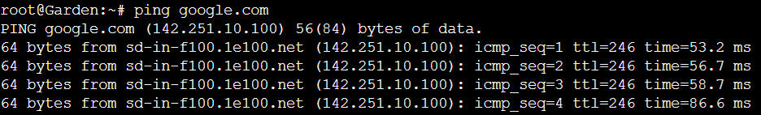

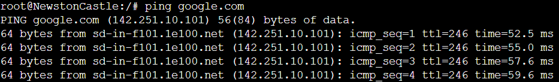

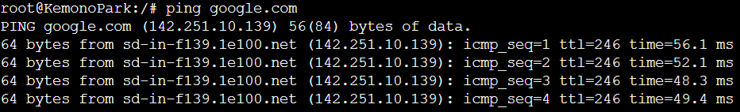

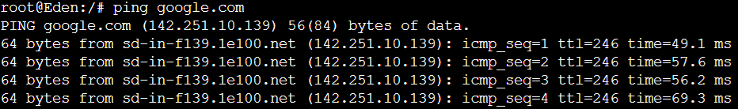

# Soal 6

Lama waktu DHCP server meminjamkan alamat IP kepada Client yang melalui Switch1 selama 5 menit sedangkan pada client yang melalui Switch3 selama 10 menit. Dengan waktu maksimal yang dialokasikan untuk peminjaman alamat IP selama 115 menit.

## Pengerjaan Soal

Edit file `/etc/dhcp/dhcpd.conf` dan tambahkan syntax `default-lease-time` dan `max-lease-time` pada subnet yang akan mendapatkan alamat IP dari DHCP server sebagai berikut

```bash
subnet 10.40.1.0 netmask 255.255.255.0 {
        range 10.40.1.50 10.40.1.88;
        range 10.40.1.120 10.40.1.155;
        option routers 10.40.1.1;
        option broadcast-address 10.40.1.255;
        option domain-name-servers 10.40.2.2;
        default-lease-time 300;
        max-lease-time 6900;
}

subnet 10.40.2.0 netmask 255.255.255.0 {}

subnet 10.40.3.0 netmask 255.255.255.0 {
        range 10.40.3.10 10.40.3.30;
        range 10.40.3.60 10.40.3.85;
        option routers 10.40.3.1;
        option broadcast-address 10.40.3.255;
        option domain-name-servers 10.40.2.2;
        default-lease-time 600;
        max-lease-time 6900;
}
```

Setelah itu jangan lupa untuk merestart `isc-dhcp-server` nya.

```
service isc-dhcp-server restart
```

## Kendala

Tidak ada kendala

# Soal 7

Loid dan Franky berencana menjadikan Eden sebagai server untuk pertukaran informasi dengan alamat IP yang tetap dengan IP [prefix IP].3.13 dengan Prefix IP 10.40

## Pengerjaan Soal

Menambahkan konfigurasi untuk fixed address pada ```/etc/dhcp/dhcpd.conf```

```sh
host Eden {
        hardware ethernet 7a:68:b2:d1:13:73;
        fixed-address 10.40.3.13;
}

service isc-dhcp-server restart
```

## kendala

Tidak ada

## Dokumentasi Soal 7

* Maka Eden akan mendapatkan IP ```10.40.3.13```<br>
<br>

# Soal 8

SSS, Garden, dan Eden digunakan sebagai client Proxy agar pertukaran informasi dapat terjamin keamanannya, juga untuk mencegah kebocoran data.

Pada Proxy Server di Berlint, Loid berencana untuk mengatur bagaimana Client dapat mengakses internet. Artinya setiap client harus menggunakan Berlint sebagai HTTP & HTTPS proxy. Adapun kriteria pengaturannya adalah sebagai berikut:

1. Client hanya dapat mengakses internet diluar (selain) hari & jam kerja (senin-jumat 08.00 - 17.00) dan hari libur (dapat mengakses 24 jam penuh.
2. Adapun pada hari dan jam kerja sesuai nomor (1), client hanya dapat mengakses domain loid-work.com dan franky-work.com (IP tujuan domain dibebaskan)
3. Saat akses internet dibuka, client dilarang untuk mengakses web tanpa HTTPS. (Contoh web HTTP: <http://example.com>)
4. Agar menghemat penggunaan, akses internet dibatasi dengan kecepatan maksimum 128 Kbps pada setiap host (Kbps = kilobit per second; lakukan pengecekan pada tiap host, ketika 2 host akses internet pada saat bersamaan, keduanya mendapatkan speed maksimal yaitu 128 Kbps)
5. Setelah diterapkan, ternyata peraturan nomor (4) mengganggu produktifitas saat hari kerja, dengan demikian pembatasan kecepatan hanya diberlakukan untuk pengaksesan internet pada hari libur

Setelah proxy Berlint diatur oleh Loid, dia melakukan pengujian dan mendapatkan hasil sesuai tabel berikut.

| Aksi | Senin (10.00) | Senin (20.00) | Sabtu (10.00)|
| ------------- |-------------| -----| -----|
|Akses Internet (HTTP) | X | X | X|
|Akses Internet (HTTPS) | X | V | V|
|Akses loid-work.com dan franky-work.com | V | X | X|
|Speed limit (128Kbps) | tidak bisa akses | X (Speed tidak dibatasi) | V|

X: Tidak
V: Iya

## Pengerjaan Soal

### Client Berlint

* Memindahkan file pada ```/etc/squid/squid.conf``` ke ```/etc/squid/squid.conf.bak``` dengan command:

```sh
mv /etc/squid/squid.conf /etc/squid/squid.conf.bak
```

* Memasukkan konfigurasi berikut ke dalam ```/etc/squid/work-sites.acl```

```sh
loid-work.com
franky-work.com
```

* Menambahkan konfigurasi berikut ke dalam ```/etc/squid/acl.conf``` agar internet dapat diakses pada jam tertentu. M=Senin, T=Selasa, W=Rabu, H=Kamis, F=Jumat, S=Minggu, dan A=Sabtu.

```sh
acl AVAILABLE_WORKING time MTWHF 08:00-16:59
acl AVAILABLE_INTERNET time MTWHF 17:00-23:59
acl AVAILABLE_INTERNET time MTWHF 00:00-08:00
acl AVAILABLE_INTERNET time SA 00:00-23:59
```

* Menambahkan konfigurasi berikut ke dalam ```/etc/squid/squid.conf``` agar internet dapat memblokir situs tertentu dan internet pada saat jam kerja.

```sh
include /etc/squid/acl.conf
http_port 8080
visible_hostname Berlint

acl SSL_ports port 443
acl WORKSITES dstdomain "/etc/squid/work-sites.acl"

http_access deny !SSL_ports
http_access allow WORKSITES AVAILABLE_WORKING
http_access deny WORKSITES AVAILABLE_INTERNET
http_access allow AVAILABLE_INTERNET
http_access deny AVAILABLE_WORKING
http_access deny all


delay_pools 1
delay_class 1 2
delay_access 1 allow all
delay_parameters 1 none 16000/16000
```

## Dokumentasi Soal 8 (1)

* Akses Google pada jam kerja (Senin - Jumat 10.00 - 17.00)  `lynx google.com`


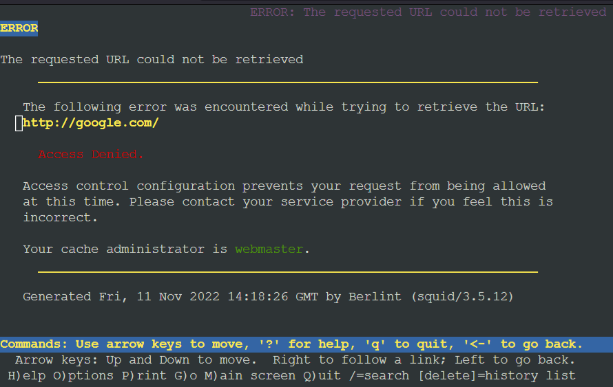

* Akses google.com di luar jam kerja (Senin - Jumat 17.00 - 08.00 [besoknya] dan Sabtu - Minggu 24 jam)  `lynx google.com`

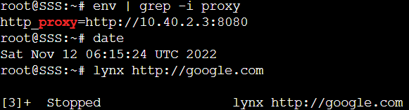
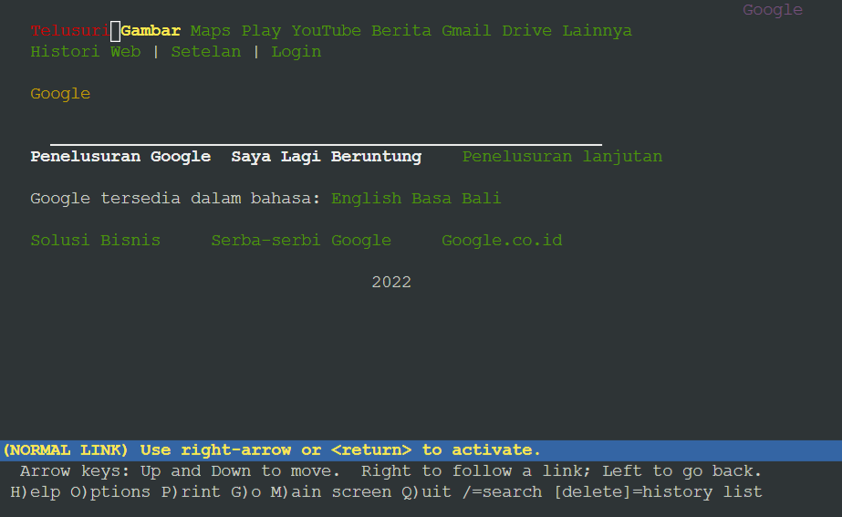

## Dokumentasi Soal 8 (2)

Pada soal 8 (2) ini masih belum work entah kenapa, sudah mencoba urutan konfigurasi yang berbeda tapi hasilnya tidak ada yang sesuai permintaan soal.

* Akses loid-work.com pada jam kerja (Senin - Jumat 10.00 - 17.00)  `lynx loid-work.com`


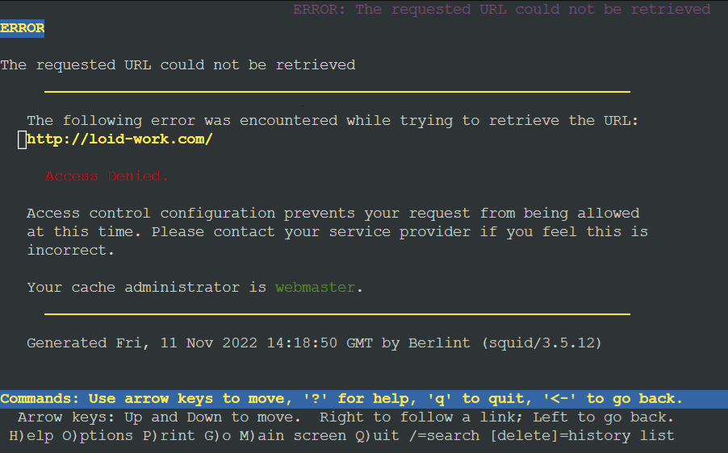

* Akses loid-work.com di luar jam kerja (Senin - Jumat 17.00 - 08.00 [besoknya] dan Sabtu - Minggu 24 jam)  `lynx loid-work.com`

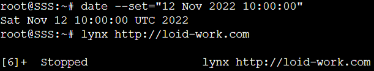
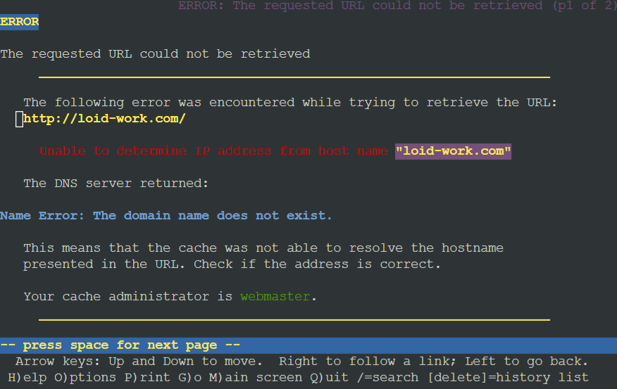

## Dokumentasi Soal 8 (3) - REVISI

* Akses google.com dengan http di luar jam kerja (Senin - Jumat 17.00 - 08.00 [besoknya] dan Sabtu - Minggu 24 jam)  `lynx http://google.com`

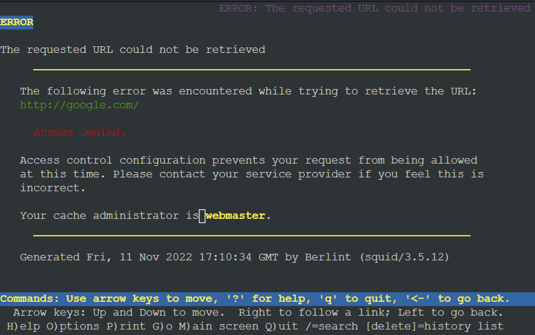

* Akses google.com dengan https di luar jam kerja (Senin - Jumat 17.00 - 08.00 [besoknya] dan Sabtu - Minggu 24 jam)  `lynx https://google.com`

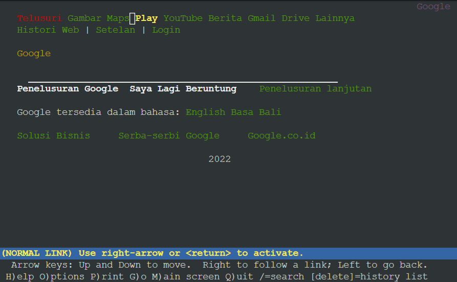

## Dokumentasi Soal 8 (4-5) - REVISI

* Tes kecepatan download dengan speedtest-cli, jangan lupa untuk install speedtest-cli terlebih dahulu. Jalankan command `speedtest` untuk melakukan speedtest.

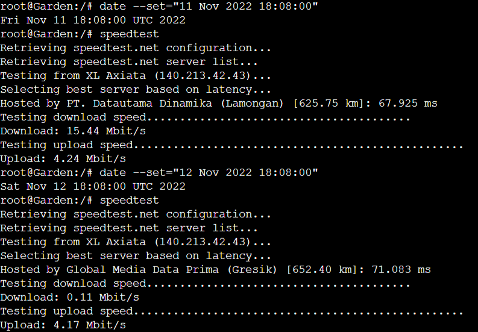
